# 🏗️ Memo — System Design Foundations

> *Source: YouTube Course Transcript — Full System Design Mastery Course*
> *Topics: Architecture, Databases, Scaling, Load Balancing, APIs, Protocols, Security*

---

## 🗺️ Course Mind Map

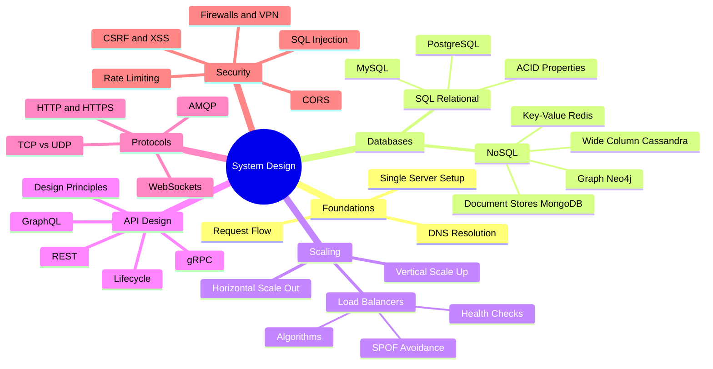

---

## 🧱 Part 1 — Foundations: From One Server to Millions

### 1.1 The Single Server Setup

Every complex system starts small. The **single server** model is the baseline: one machine runs everything — the web app, the database, the cache.

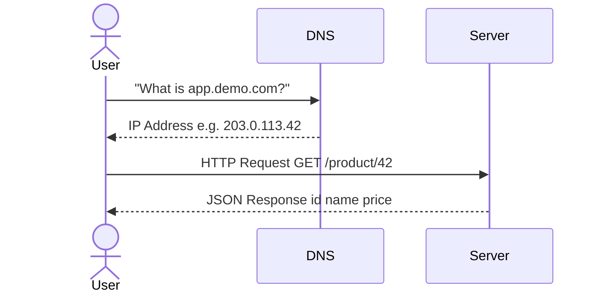

> 💡 **Term: DNS (Domain Name System)** — A global directory that translates human-readable domain names (like `app.demo.com`) into machine-readable IP addresses. Think of it as the internet phonebook.

> 💡 **Term: IP Address** — A unique numerical label assigned to each device connected to a network. Used to identify and locate servers on the internet.

**How traffic flows:**

```
Browser/Mobile App
      |
      v  (1) DNS Lookup -> gets IP
      |
      v  (2) HTTP Request to IP
      |
   [ SERVER ] ---- Web App + DB + Cache (all in one)
      |
      v  (3) Returns HTML or JSON
```

**Limitations of single server:**
- No redundancy — if it goes down, everything goes down
- Hard resource cap — cannot scale beyond one machine's limits
- Single point of failure

---

### 1.2 Separating Web Tier & Data Tier

As traffic grows, the first architectural decision is to **decouple** the application server from the database.

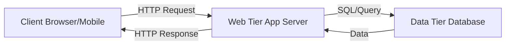

This allows each tier to be **scaled independently** based on load.

---

## 🗄️ Part 2 — Databases

### 2.1 The Two Database Families

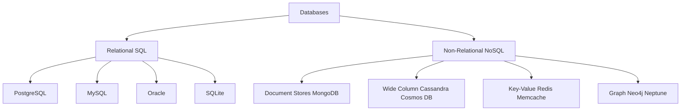

---

### 2.2 Relational Databases (SQL)

**Structure:** Data lives in **tables** (like spreadsheets), with **columns** (fields) and **rows** (records).

| ID | Name | Age | Email |
|----|------|-----|-------|
| 1 | John | 30 | john@example.com |
| 2 | Sara | 25 | sara@example.com |

**JOIN Operations** — linking multiple tables:

```
customers table --+
                  +--> orders table (customer_id + product_id)
products table  --+
```

**ACID Properties** (the 4 guarantees of SQL transactions):

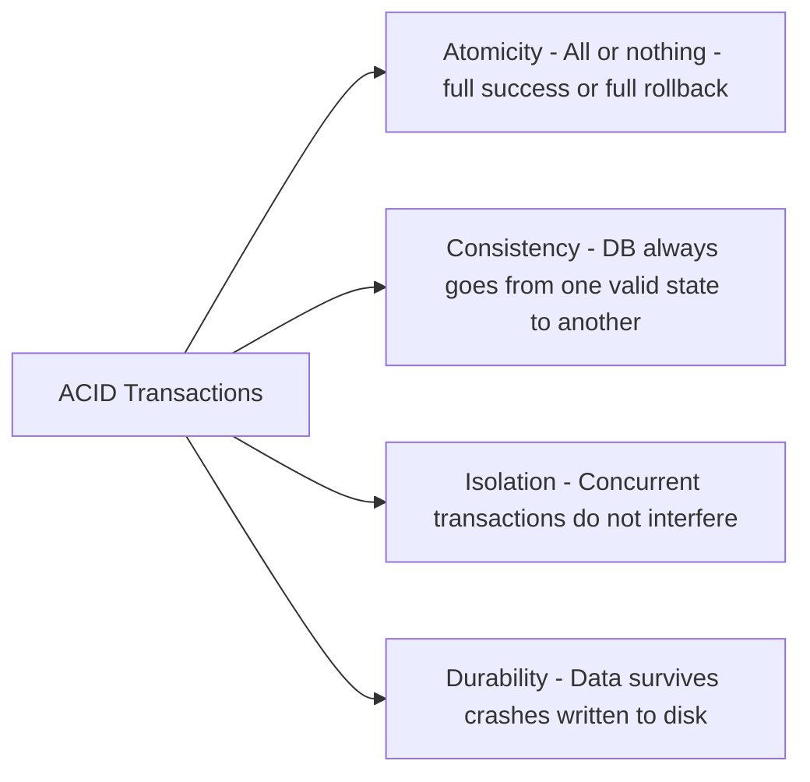

> 💡 **Term: Transaction** — A sequence of one or more SQL operations treated as a single atomic unit. Classic example: a bank transfer — debit account A AND credit account B must both succeed, or neither happens.

> 💡 **Term: ACID** — Atomicity, Consistency, Isolation, Durability. The four properties that guarantee database transactions are processed reliably.

---

### 2.3 Non-Relational Databases (NoSQL)

**The 4 NoSQL Types at a glance:**

| Type | Example | Data Model | Best For |
|------|---------|------------|----------|
| Document Store | MongoDB | JSON-like docs | Flexible schemas, nested data |
| Wide Column | Cassandra | Tables + dynamic cols | Massive write throughput |
| Key-Value | Redis | Key to Value in RAM | Caching, sessions, speed |
| Graph | Neo4j, Neptune | Nodes + Edges | Relationships, recommendations |

**MongoDB document example (single record = everything):**

```json
{
  "user_id": "123",
  "name": "John",
  "orders": [
    { "product_id": "p1", "name": "Laptop", "price": 999 },
    { "product_id": "p2", "name": "Mouse",  "price": 29  }
  ]
}
```

vs SQL which would need a JOIN across 3 tables to get the same result.

> 💡 **Term: Key-Value Store** — A database where data is stored as simple pairs: a unique key maps to a value. Since Redis keeps data in RAM, reads/writes are microsecond-fast. Used for caching, session storage, leaderboards.

> 💡 **Term: Graph Database** — Stores entities (nodes) and their relationships (edges). Amazon uses Neptune for product recommendations: "people who bought X also bought Y."

---

### 2.4 SQL vs NoSQL — Decision Guide

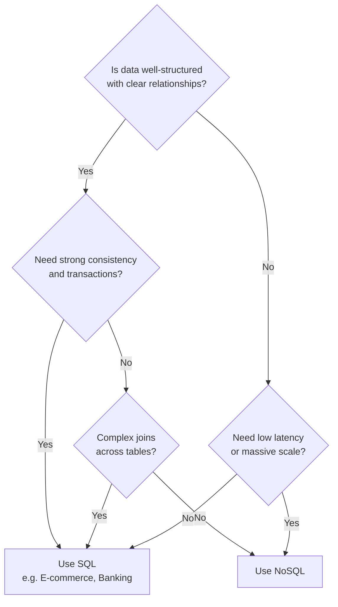

---

## ⚖️ Part 3 — Scaling

### 3.1 Vertical vs Horizontal Scaling

| | Vertical Scaling | Horizontal Scaling |
|--|--|--|
| How | Bigger machine | More machines |
| Limit | Hard ceiling max hardware | Near infinite |
| Fault tolerance | None SPOF | High |
| Cost | Expensive per unit | Scales gradually |
| Complexity | Simple | Needs Load Balancer |

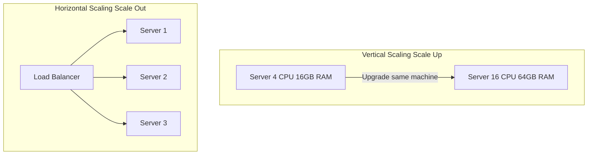

> 💡 **Term: Fault Tolerance** — The ability of a system to continue operating correctly even when one or more of its components fail.

---

### 3.2 Load Balancers

A **load balancer** sits in front of multiple servers and distributes incoming requests so no single server is overwhelmed.

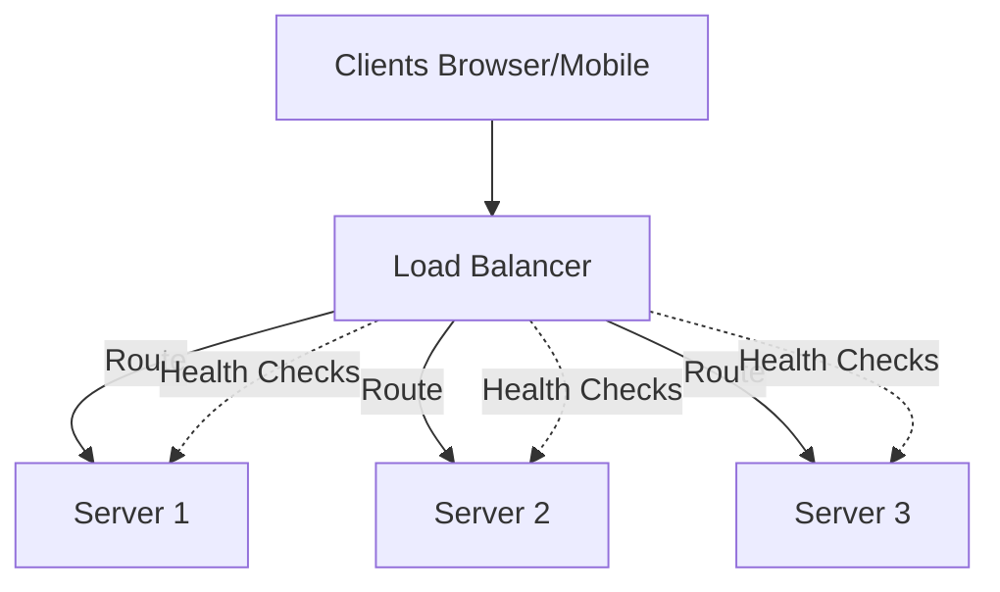

> 💡 **Term: Load Balancer** — A component that distributes incoming network traffic across multiple servers to ensure no single server is overloaded. Also performs health checks to route traffic away from failed servers.

---

### 3.3 Load Balancing Algorithms

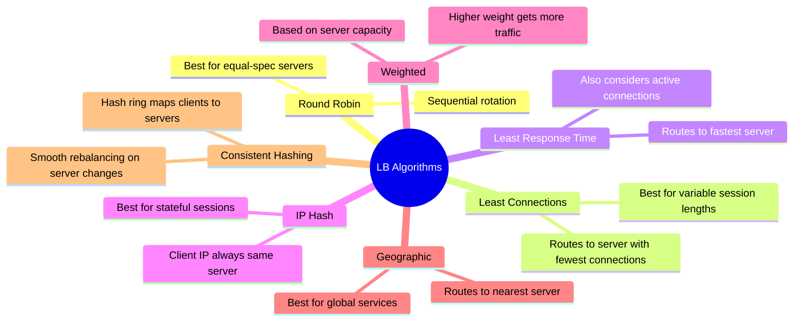

**IP Hash visual:**
```
Client A IP 1.2.3.4 --> hash result --> Server 2 (always)
Client B IP 5.6.7.8 --> hash result --> Server 1 (always)
```

**Consistent Hashing ring concept:**
```
         Server 1
        /         \
  Server 3    Server 2
        \         /
         (Ring)
  
  New request -> placed on ring -> goes to nearest server clockwise
```

---

### 3.4 Single Point of Failure (SPOF)

> 💡 **Term: Single Point of Failure (SPOF)** — Any component in a system whose failure causes the entire system to stop working. Must be identified and eliminated in production architectures.

**Example: Database as SPOF**

```
Clients -> Load Balancer -> [Server 1, Server 2, Server 3]
                                   |         |         |
                              [Single DB] <- SPOF
                           (if it dies -> all servers fail)
```

**SPOF Impact:**
- **Reliability**: One failure = total outage = revenue loss
- **Scalability**: Cannot scale without fixing the SPOF
- **Security**: Attackers can DDoS the single weak point

**Fixing Load Balancer SPOF:**

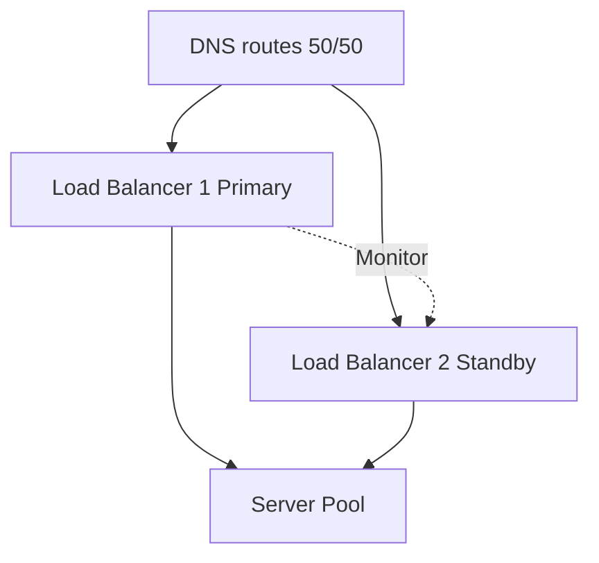

Strategies:
1. **Redundancy** — Run 2+ load balancers; if one fails, traffic goes to the other
2. **Health checks** — Continuously monitor LB health; reroute on failure
3. **Self-healing** — Auto-replace failed LB with a new instance

---

## 🔌 Part 4 — API Design

### 4.1 What is an API?

> 💡 **Term: API (Application Programming Interface)** — A contract that defines how software components communicate. It specifies what requests can be made, what format they must use, and what responses to expect. The implementation details behind the API are hidden from the caller.

```
Client Browser/Mobile
        |
        |  "I want product #42"
        v
    [ API Contract ]  <- defines: endpoints, methods, response format
        |
        v
   Server implements the logic
```

**Two key roles of an API:**
- **Abstraction** — hide implementation, expose only the interface
- **Service boundaries** — decouple systems so they can evolve independently

---

### 4.2 The 3 API Styles Compared

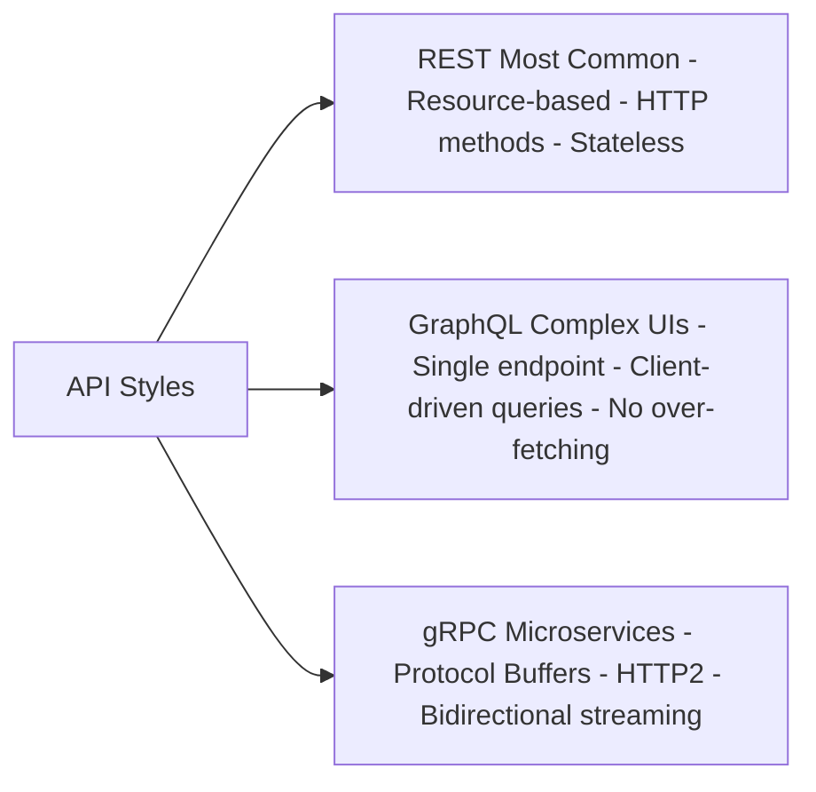

**REST vs GraphQL — Concrete Example:**

REST requires 3 separate requests:
```http
GET /v1/users/123
GET /v1/users/123/posts
GET /v1/users/123/followers
```

GraphQL does it in 1 single request:
```graphql
query {
  user(id: "123") {
    name
    posts { title content }
    followers { name }
  }
}
```

**Quick API Style Selection Table:**

| Need | Use |
|------|-----|
| Standard web/mobile app | REST |
| Complex UI needing nested data in one request | GraphQL |
| High-performance server-to-server communication | gRPC |
| Real-time bidirectional such as chat or games | WebSocket |

> 💡 **Term: REST (Representational State Transfer)** — An architectural style for APIs using HTTP methods (GET, POST, PUT, DELETE) on resources (URLs). Each request is stateless — it contains all information needed to be processed independently.

> 💡 **Term: GraphQL** — A query language for APIs where the client specifies the exact shape of the data it needs. Created by Facebook to eliminate over-fetching and under-fetching problems.

> 💡 **Term: gRPC** — Google Remote Procedure Call framework. Uses Protocol Buffers (binary format) over HTTP/2. Extremely efficient for microservice-to-microservice communication.

---

### 4.3 The 4 API Design Principles

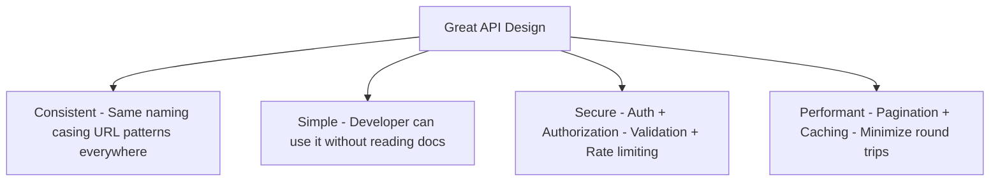

---

### 4.4 API Lifecycle

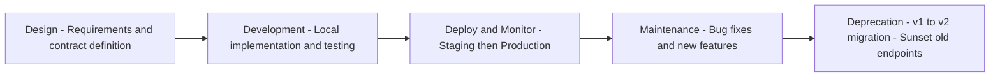

---

### 4.5 REST API Best Practices

**URL Design:**
```
Good:  GET    /api/v1/products
Good:  GET    /api/v1/products/42
Good:  POST   /api/v1/products
Good:  PUT    /api/v1/products/42
Good:  DELETE /api/v1/products/42

Bad:   GET    /dee
Bad:   GET    /getProduct?id=42
```

**Filtering, Sorting, Pagination:**
```http
GET /api/v1/products?page=3&limit=20&sort=price&order=asc
```

**Versioning:** Always prefix with `/v1/`, `/v2/` so old clients do not break when you update.

---

### 4.6 GraphQL Schema Design

```graphql
type User {
  id: ID!
  name: String!
  posts: [Post]
}

type Post {
  id: ID!
  title: String!
  body: String
}

type Query {
  user(id: ID!): User
}

type Mutation {
  createPost(title: String!, body: String): Post
}
```

**Error handling in GraphQL — always returns HTTP 200, errors in body:**
```json
{
  "data": { "user": null },
  "errors": [
    { "message": "User not found", "status": 404, "path": ["user"] }
  ]
}
```

---

## 📡 Part 5 — Protocols

### 5.1 The Network Stack (Simplified)

```
+------------------------------------------+
|  APPLICATION LAYER                       |
|  HTTP  HTTPS  WebSocket  AMQP  gRPC      |  <- We work here
+------------------------------------------+
|  TRANSPORT LAYER                         |
|  TCP  UDP                                |  <- Delivers packets
+------------------------------------------+
|  NETWORK LAYER (IP)                      |
+------------------------------------------+
|  DATA LINK + PHYSICAL                    |
+------------------------------------------+
```

---

### 5.2 HTTP vs HTTPS

> 💡 **Term: HTTP (HyperText Transfer Protocol)** — The foundation of data communication on the web. Defines request/response message formats between clients and servers.

> 💡 **Term: HTTPS** — HTTP with TLS/SSL encryption. Data is encrypted in transit. The golden standard — always use HTTPS in production.

**HTTP Request anatomy:**
```http
GET /api/products/42 HTTP/1.1
Host: api.example.com
Authorization: Bearer eyJhbGci...
Content-Type: application/json
```

**HTTP Response anatomy:**
```http
HTTP/1.1 200 OK
Content-Type: application/json
Cache-Control: max-age=3600

{ "id": 42, "name": "Laptop", "price": 999 }
```

**HTTP Status Codes:**

| Range | Meaning | Examples |
|-------|---------|---------|
| 2xx | Success | 200 OK, 201 Created, 204 No Content |
| 3xx | Redirect | 301 Moved, 304 Not Modified |
| 4xx | Client Error | 400 Bad Request, 401 Unauthorized, 404 Not Found |
| 5xx | Server Error | 500 Internal Error, 503 Service Unavailable |

---

### 5.3 WebSockets

**The problem with HTTP polling:**
```
Client: "Any new messages?" --> Server: "No"   (wasted request)
Client: "Any new messages?" --> Server: "No"   (wasted request)
Client: "Any new messages?" --> Server: "Yes!" (finally)
```

**WebSocket solution — persistent bidirectional connection:**
```
Client <-------------------------------------------------> Server
            Single TCP connection stays open
            Server can PUSH data anytime
            No polling needed
```

> 💡 **Term: WebSocket** — A protocol that establishes a persistent, full-duplex connection between client and server. Unlike HTTP (request-response), WebSockets let the server push data to clients instantly. Used in: chat apps, live notifications, stock tickers, collaborative tools.

---

### 5.4 AMQP — Message Queues

> 💡 **Term: AMQP (Advanced Message Queuing Protocol)** — A protocol for asynchronous messaging between services using a message broker (like RabbitMQ). Producers put messages in a queue; consumers pick them up when ready. Decouples services and handles traffic spikes gracefully.

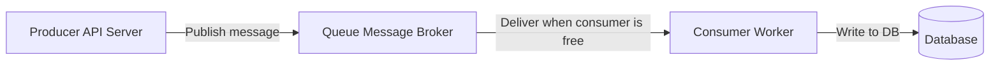

**Exchange types:**
- **Direct**: One producer to one specific consumer
- **Fan-out**: One message broadcast to all consumers
- **Topic**: Route based on message topic or pattern

---

### 5.5 TCP vs UDP

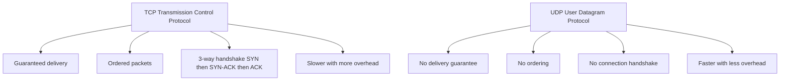

**TCP 3-Way Handshake:**
```
Client ---- SYN -----------------------------> Server
Client <--- SYN-ACK ------------------------- Server
Client ---- ACK -----------------------------> Server
             Connection established
```

**When to use which:**

| Protocol | Use when | Examples |
|----------|----------|---------|
| TCP | Data must be complete and ordered | Banking, auth, email, e-commerce |
| UDP | Speed matters, some loss is OK | Video calls, live streaming, gaming |

> 💡 **Term: TCP (Transmission Control Protocol)** — A connection-oriented transport protocol that guarantees all packets arrive in order. Slower but reliable.

> 💡 **Term: UDP (User Datagram Protocol)** — A connectionless transport protocol. No delivery guarantees, but significantly faster. Used when real-time speed matters more than perfect completeness.

---

### 5.6 gRPC Deep Dive

> 💡 **Term: Protocol Buffers (Protobuf)** — A binary serialization format by Google. Smaller and faster than JSON. Used with gRPC for defining service contracts.

```protobuf
service ProductService {
  rpc GetProduct (ProductRequest) returns (ProductResponse);
}

message ProductRequest {
  string product_id = 1;
}

message ProductResponse {
  string id = 1;
  string name = 2;
  float price = 3;
}
```

**Why gRPC beats REST for microservices:**
- Uses HTTP/2 (multiplexing, header compression)
- Binary format (protobuf) is ~10x smaller payload than JSON
- Supports server-side, client-side, and bidirectional streaming

---

## 🔐 Part 6 — API Security

### 6.1 The 7 Security Techniques

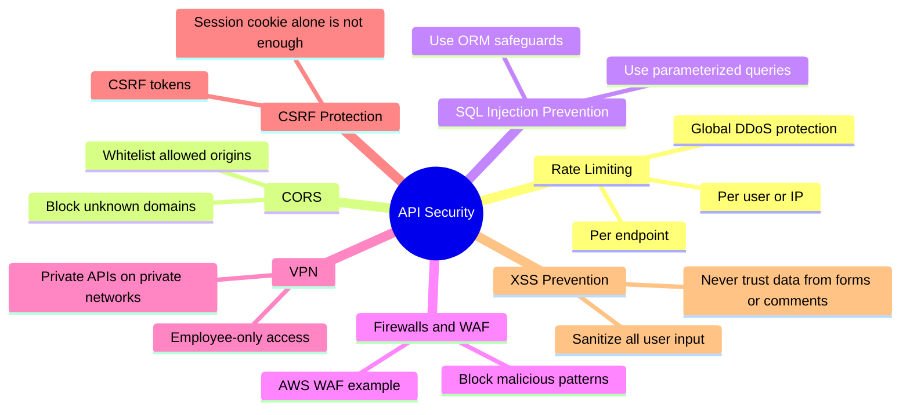

---

### 6.2 Rate Limiting

```
User A: request 1    -> OK
User A: request 50   -> OK
User A: request 100  -> OK
User A: request 101  -> BLOCKED - wait before next request

Global: All users combined > threshold -> DDoS protection kicks in
```

**Layers of rate limiting:**
- **Per endpoint** — stricter limits for sensitive routes like /login
- **Per user/IP** — block individual abusive clients
- **Global** — prevent coordinated bot attacks

---

### 6.3 SQL Injection — Attack & Defense

**Attack example:**
```sql
-- User input: ' OR '1'='1' --
SELECT * FROM users WHERE username = '' OR '1'='1' --'
-- This bypasses authentication entirely!
```

**Defense — Parameterized queries:**
```python
# Safe: parameters are escaped automatically
cursor.execute("SELECT * FROM users WHERE username = ?", (user_input,))
```

---

### 6.4 CSRF vs XSS

| | CSRF | XSS |
|--|------|-----|
| What | Tricks browser into making unwanted requests | Injects malicious scripts into pages |
| Attack | Uses victim session cookie from malicious site | Attacker puts script tag in comment field |
| Defense | CSRF tokens plus SameSite cookies | Sanitize and escape all user input |

---

## 📊 Architecture Evolution

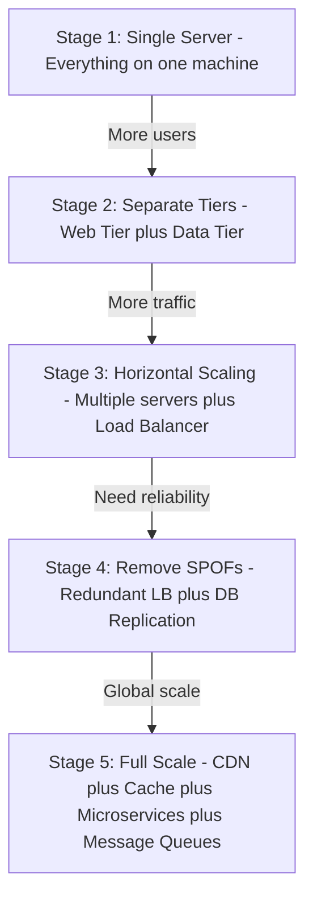

---

## 🃏 Flashcards

#flashcard
Q: What does DNS stand for and what does it do?
A: Domain Name System. It maps human-readable domain names (e.g. app.demo.com) to IP addresses. When a user types a URL, their browser queries DNS to get the server IP address before sending any HTTP request.

---

#flashcard
Q: What are the 4 ACID properties of SQL transactions?
A: Atomicity (all or nothing), Consistency (DB stays in a valid state), Isolation (concurrent transactions do not interfere), Durability (data survives crashes). Classic example: bank transfer — both debit and credit must succeed, or neither happens.

---

#flashcard
Q: What are the 4 types of NoSQL databases and their examples?
A: 1. Document Store (MongoDB) — JSON-like docs. 2. Wide Column (Cassandra, Cosmos DB) — massive write throughput. 3. Key-Value (Redis, Memcache) — in-RAM, ultra-fast. 4. Graph (Neo4j, Neptune) — relationships and recommendations.

---

#flashcard
Q: When should you choose SQL vs NoSQL?
A: SQL: structured data with clear relationships, need strong ACID transactions (banking, e-commerce). NoSQL: unstructured or semi-structured data, need super low latency, massive scale, or flexible schemas (caching, recommendations, social feeds).

---

#flashcard
Q: What is the difference between Vertical Scaling and Horizontal Scaling?
A: Vertical (Scale Up) = add more CPU/RAM to the same server. Has a hard ceiling and is a SPOF. Horizontal (Scale Out) = add more servers. Near-infinite scalability, high fault tolerance, requires a load balancer.

---

#flashcard
Q: What is a Single Point of Failure (SPOF) and what are its 3 risks?
A: A SPOF is any component whose failure takes down the entire system. Risks: 1. Reliability (total outage = revenue loss). 2. Scalability (cannot scale safely). 3. Security (DDoS a single target to kill the whole system).

---

#flashcard
Q: Name 4 Load Balancing algorithms and when to use each.
A: 1. Round Robin — equal-spec servers, simple sequential rotation. 2. Least Connections — variable session lengths, routes to server with fewest active connections. 3. IP Hash — stateful sessions, same client always hits same server. 4. Consistent Hashing — distributed systems, smooth rebalancing when servers join or leave.

---

#flashcard
Q: What is the core difference between REST and GraphQL?
A: REST uses multiple resource-based endpoints returning fixed response structures with HTTP methods. GraphQL uses a single endpoint and lets the client define the exact response shape in one query, eliminating over-fetching and multiple round trips.

---

#flashcard
Q: What are the 4 principles of great API design?
A: 1. Consistent — same naming, casing, URL patterns. 2. Simple — usable without reading docs. 3. Secure — authentication, authorization, rate limiting, input validation. 4. Performant — pagination, caching, minimize round trips.

---

#flashcard
Q: What is the difference between TCP and UDP? When do you use each?
A: TCP = reliable, ordered, 3-way handshake, slower. Use for: banking, auth, email, payments. UDP = fast, no delivery guarantee, no connection overhead. Use for: video calls, live streaming, gaming — where some packet loss is acceptable.

---

#flashcard
Q: What is a WebSocket and how does it differ from HTTP?
A: WebSocket establishes a persistent, full-duplex TCP connection. Unlike HTTP (request-response only), WebSockets allow the server to PUSH data to the client at any time without the client asking. Used in: real-time chat, live notifications, multiplayer games.

---

#flashcard
Q: What is AMQP and what problem does it solve?
A: Advanced Message Queuing Protocol enables async communication between services via a message queue. A producer puts messages in the queue; consumers pick them up when free. Solves: decoupling services and handling traffic spikes without dropping requests.

---

#flashcard
Q: What is the difference between CSRF and XSS attacks?
A: CSRF: tricks a logged-in user browser into making an unwanted request using their session cookie. Prevented with CSRF tokens. XSS: attacker injects malicious script tags into user-generated content; other users browsers execute the script. Prevented by sanitizing and escaping all user input.

---

#flashcard
Q: What is gRPC and why is it preferred for microservices over REST?
A: gRPC (Google Remote Procedure Call) uses Protocol Buffers (binary format) over HTTP/2. It is approximately 10x smaller payload than JSON, supports bidirectional streaming, and has lower latency. Preferred between internal services because browsers do not natively support HTTP/2 well.

---

#flashcard
Q: What is Rate Limiting and what 3 levels can it be applied?
A: Rate limiting restricts how many requests a client can make in a time window. Levels: 1. Per endpoint (stricter for sensitive routes like /login). 2. Per user/IP (block individual abusive clients). 3. Global (protect against coordinated DDoS from bot networks).

---

*Tags: #system-design #architecture #backend #databases #scaling #api #protocols #security #flashcards*
