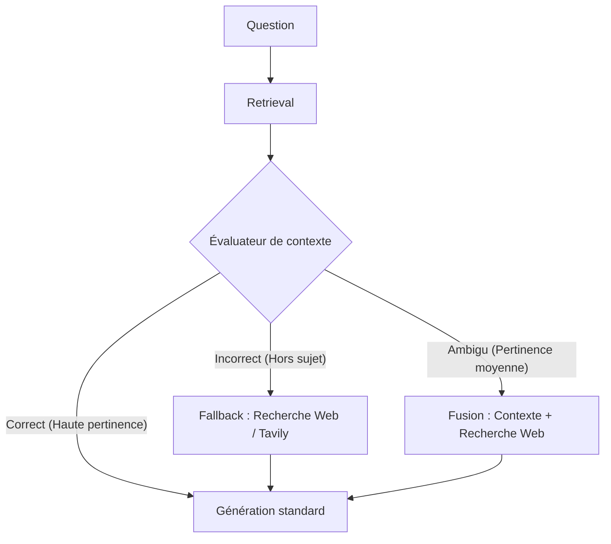

# 📝 Mémo S5-J4 : RAG Avancé — Contextual Retrieval, CRAG & GraphRAG

*Ce document valide les tâches `S5-J4-T2` et `S5-J4-T4` (concepts avancés).*

---

## 1. Contextual Retrieval (Anthropic)

Dans les systèmes RAG traditionnels, les documents sont découpés en petits morceaux (chunks) indépendants. Cette opération détruit le contexte global. 

### La solution d'Anthropic :
1.  **Contextual Embeddings** : Pour chaque chunk, on demande à un LLM rapide d'écrire une courte phrase (50-100 mots) décrivant le contexte global du document parent. On concatène ce préfixe au début du chunk avant de calculer son vecteur.
    *   *Exemple brut* : *"Son chiffre d'affaires a augmenté de 20%."*
    *   *Exemple contextualisé* : *"Ce paragraphe est extrait du rapport financier d'Apple Inc pour le T3 2024. Son chiffre d'affaires a augmenté de 20%."*
2.  **Contextual BM25** : De la même manière, on ajoute ces explications de contexte pour assister l'indexation par mots-clés dans BM25.
3.  **Résultat** : La combinaison du Contextual Retrieval et du Reranking réduit le taux d'erreur de récupération de **67%** (divisé par 3 !).

---

## 2. CRAG (Corrective RAG)

CRAG introduit un module d'évaluation intermédiaire pour valider la qualité du contexte extrait avant de l'envoyer au LLM.

*   **Avantage** : Évite les réponses basées sur des fausses pistes sémantiques en basculant dynamiquement sur du Web Search si la base de données interne est vide ou obsolète.

---

## 3. Self-RAG (Self-Reflective RAG)

Self-RAG va encore plus loin en apprenant au LLM à générer des **jetons de réflexion spéciaux (reflection tokens)** pour auto-évaluer ses réponses à la volée.

*   **`[Retrieve]`** : Le modèle décide lui-même s'il a besoin de faire une recherche pour répondre à la phrase courante.
*   **`[Is-Grounded]`** : Le modèle évalue si la phrase générée est entièrement soutenue par le contexte fourni.
*   **`[Is-Useful]`** : Le modèle évalue si la réponse répond réellement à la question de l'utilisateur.
Le système génère plusieurs réponses candidates et retient celle qui obtient les meilleures notes d'auto-critique.

---

## 4. GraphRAG (Knowledge Graph RAG)

Alors que le RAG vectoriel est excellent pour les questions locales (*"Quelle est la date de X ?"*), il échoue sur les questions globales (*"Quels sont les thèmes principaux de ce livre ?"*).

*   **Architecture** : 
    1. Un LLM extrait toutes les **Entités** (noms propres, concepts, dates) et leurs **Relations** sous forme de graphe `(Sujet, Relation, Objet)`.
    2. Un algorithme de détection de communautés (ex: algorithme de Leiden) regroupe les nœuds interconnectés en clusters thématiques.
    3. Pour chaque cluster, le LLM génère un résumé global de la communauté.
*   **Recherche globale** : Pour répondre à une question thématique large, le RAG interroge directement les résumés de ces communautés au lieu de parcourir des milliers de chunks vectoriels individuels.

---

## 5. Notre Implémentation Pratique
Nous avons mis en pratique ces concepts de manière 100% locale sur notre document technique :
*   **Contextual Retrieval (`contextual_indexing.py`)** : Découpage du PDF, appel à Ollama `llama3.1` pour générer un header contextuel (Anthropic style) d'une phrase par chunk, et indexation des 6 chunks enrichis dans la collection Chroma `rag_contextual_test`.
*   **GraphRAG hybride (`graph_rag.py`)** : Extraction automatique de 23 triplets entités-relations structurés via Ollama, enregistrés dans `knowledge_graph.json`. Recherche hybride combinant la similarité vectorielle et les relations extraites du graphe pour enrichir le prompt final.

---

## Flashcards (Anki / Active Recall)

#flashcard
Q: Qu'est-ce que le "Contextual Retrieval" d'Anthropic et quel problème résout-il ?
A: Il s'agit d'ajouter un court résumé du contexte général du document parent (généré par LLM) en tête de chaque chunk avant sa vectorisation. Cela résout la perte de contexte global causée par le découpage.

#flashcard
Q: Quelle est la différence fondamentale entre CRAG (Corrective RAG) et un RAG standard ?
A: CRAG évalue la pertinence des documents récupérés à l'aide d'un évaluateur et déclenche un fallback (recherche web) si les documents internes sont jugés hors sujet.

#flashcard
Q: Comment fonctionne le mécanisme d'auto-réflexion dans Self-RAG ?
A: Le LLM est entraîné à insérer des jetons spéciaux dans son texte (`[Retrieve]`, `[Is-Grounded]`, `[Is-Useful]`) pour décider quand chercher et évaluer la fidélité de ses propres réponses par rapport au contexte.

#flashcard
Q: Pourquoi le RAG vectoriel classique échoue-t-il sur les questions globales sémantiques, et comment GraphRAG y pallie-t-il ?
A: Le RAG classique ne peut pas synthétiser des milliers de morceaux disjoints en une seule requête. GraphRAG y pallie en construisant un graphe d'entités et en regroupant les nœuds en communautés résumées à l'avance par un LLM.
