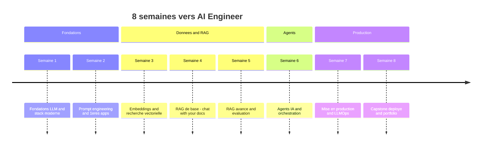

# 🧭 Roadmap — Devenir AI Engineer (Généraliste) en 8 semaines

> **Profil ciblé :** bases ML/DL acquises · **~20 h / semaine** · objectif **ingénieur IA généraliste**
> **Durée :** 8 semaines · **~160 h** au total · **100 % ressources gratuites**
> **Approche :** *hands-on* — 1 livrable concret par semaine, ~60 % pratique / ~40 % théorie
> **Format :** guide modulaire (1 partie par semaine) optimisé pour un *second brain*

**📍 Partie 0 / 9 — Introduction & mode d'emploi**

---

## 📋 Table des matières du guide complet

| Partie | Contenu | Livrable de la semaine |
|---|---|---|
| **0** | Introduction & mode d'emploi *(ce document)* | — |
| **1** | Semaine 1 — Fondations LLM & stack moderne | Script multi-LLM + *tool calling* |
| **2** | Semaine 2 — Prompt engineering & premières apps LLM | API LLM avec *streaming* |
| **3** | Semaine 3 — Embeddings & recherche vectorielle | Moteur de recherche sémantique |
| **4** | Semaine 4 — RAG (systèmes de base) | « Chat with your docs » |
| **5** | Semaine 5 — RAG avancé & évaluation | Upgrade du RAG de S4 |
| **6** | Semaine 6 — Agents IA & orchestration | Agent outillé / multi-agents |
| **7** | Semaine 7 — Mise en production & LLMOps | App instrumentée (tracing + éval) |
| **8** | Semaine 8 — Capstone, déploiement & portfolio | Capstone déployé |
| **9** | Annexes — Ressources, repos, cheat sheets, glossaire | — |

> Chaque partie « semaine » suit **exactement la même structure** (voir [§ Anatomie d'une semaine](#-anatomie-dune-semaine)) pour que ton second brain puisse la parser de façon fiable.

---

## 🎯 À qui s'adresse cette roadmap

Ce guide part du principe que tu as **déjà les fondamentaux** et que tu veux les transformer en **compétences d'ingénierie IA déployables en production**.

**Prérequis supposés acquis (on ne les ré-enseigne pas) :**
- 🟢 Python intermédiaire (fonctions, classes, environnements virtuels, `pip`, lecture de doc)
- 🟢 Bases ML/DL : ce qu'est un modèle, entraînement/inférence, embeddings (notion), réseaux de neurones (idée générale)
- 🟢 Git/GitHub (clone, commit, push) et usage d'un terminal
- 🟢 Notions d'API REST (requête/réponse, JSON, clés d'API)

**Si un prérequis est fragile :** ce n'est pas bloquant. Chaque semaine signale un encart *« Refresh éclair »* avec une ressource courte pour combler le trou sans casser le rythme.

---

## 🏁 Ce que tu sauras faire après 8 semaines

À la fin, tu seras capable de **concevoir, construire, évaluer et déployer** une application IA complète. Concrètement :

- ✅ Intégrer et **router plusieurs LLM** (API propriétaires + modèles open-source en local)
- ✅ Maîtriser le **prompt engineering avancé** et les **sorties structurées** fiables
- ✅ Construire un **pipeline RAG de production** (chunking, recherche hybride, reranking, citations)
- ✅ **Évaluer** rigoureusement un système IA (métriques, jeux de test, détection de régressions)
- ✅ Concevoir des **agents IA** outillés et des systèmes **multi-agents**
- ✅ Mettre en place l'**observabilité, les garde-fous et le contrôle des coûts** (LLMOps)
- ✅ **Déployer** une app conteneurisée et la documenter dans un **portfolio crédible**

**Preuve tangible :** 8 livrables hebdomadaires + 1 projet capstone déployé et documenté → un **portfolio GitHub** prêt à montrer.

---

## 🗺️ Vue d'ensemble des 8 semaines

Le parcours est organisé en **4 phases** :

| Phase | Semaines | Objectif de phase |
|---|---|---|
| 🧱 **Fondations** | 1 – 2 | Parler aux LLM proprement : APIs, structured outputs, prompting, 1ère app |
| 🔎 **Données & RAG** | 3 – 5 | Donner de la connaissance aux LLM : embeddings, vector search, RAG (base → avancé) |
| 🤖 **Agents** | 6 | Donner de l'autonomie : raisonnement, outils, orchestration multi-agents |
| 🚀 **Production** | 7 – 8 | Rendre ça fiable et déployable : LLMOps, guardrails, capstone, portfolio |

**Timeline détaillée :**

| Sem. | Thème | Focus principal | Livrable |
|:---:|---|---|---|
| **1** | Fondations LLM & stack | APIs (Anthropic/OpenAI/Ollama), structured outputs, function calling | Script multi-LLM + tool calling |
| **2** | Prompt engineering & apps | CoT / ReAct / few-shot, templating, FastAPI, streaming | API LLM avec streaming |
| **3** | Embeddings & vector search | Modèles d'embeddings, Chroma/Qdrant/pgvector, indexation, similarité | Moteur de recherche sémantique |
| **4** | RAG (base) | Parsing docs, stratégies de chunking, retrieval, augmentation + citations | « Chat with your docs » |
| **5** | RAG avancé & évaluation | Hybrid search (BM25+vecteurs), reranking, HyDE/RAG-Fusion, Knowledge Graphs, RAGAS | Upgrade du RAG S4 |
| **6** | Agents & orchestration | ReAct, LangGraph, LlamaIndex, CrewAI/AutoGen, mémoire d'agent | Agent outillé / multi-agents |
| **7** | Production & LLMOps | Serving async, caching sémantique, tracing, guardrails, coûts | App instrumentée |
| **8** | Capstone & déploiement | Projet E2E, Docker, déploiement free-tier, doc + writeup portfolio | Capstone déployé |

<details>
<summary>📈 Timeline visuelle (Mermaid — s'affiche dans Obsidian, Notion, GitHub… sinon ignore ce bloc)</summary>


</details>

---

## 🧰 La stack que tu vas maîtriser

Une carte des outils que tu vas toucher (tous gratuits / open-source ou avec free-tier généreux) :

- **Langage & base** : Python · `venv`/`uv` · Git/GitHub · Jupyter/VS Code
- **LLM (API)** : Anthropic Claude · OpenAI · *(free-tier : Groq, Google AI Studio, OpenRouter)*
- **LLM (local/open)** : Ollama · Hugging Face Hub · `transformers`
- **Frameworks app** : FastAPI · Pydantic · *(orchestration)* LangChain · LangGraph · LlamaIndex
- **Multi-agents** : CrewAI · AutoGen
- **Embeddings & Vector DB** : `sentence-transformers` · Chroma · Qdrant · pgvector · FAISS
- **RAG avancé** : recherche hybride (BM25) · rerankers · Knowledge Graphs (GraphRAG) · RAGAS *(évaluation)*
- **Observabilité / LLMOps** : LangSmith · Phoenix (Arize) · Langfuse
- **Garde-fous** : modération · détection prompt injection / PII
- **Déploiement** : Docker · Hugging Face Spaces · free-tier cloud (Render/Railway/Fly.io)
- **Multimodal (optionnel S8)** : Whisper (audio) · modèles vision

> ⚠️ Les versions et liens **exacts** de chaque ressource sont fournis **dans la partie de la semaine concernée** et centralisés en **Annexe** (Partie 9), pour rester toujours à jour.

---

## 🧠 Comment utiliser ce guide avec ton *second brain*

Ce guide est écrit pour être **importé dans ton second brain** (Notion, Obsidian, Logseq…) et **transformé en tâches quotidiennes** par une IA. Voici la logique.

### Anatomie d'une semaine

Chaque partie « Semaine N » contient les sections suivantes, **toujours dans le même ordre** :

1. **🎯 Objectifs** — ce que tu sais faire à la fin de la semaine
2. **🧩 Concepts clés** — la liste des notions à intégrer
3. **📚 Ressources gratuites** — classées par type (voir [légende](#-légende--conventions))
4. **💻 Repos GitHub** — code de référence à lire / forker
5. **🛠️ Projet / Livrable** — le rendu concret de la semaine
6. **🗓️ Plan jour par jour** — tâches atomiques avec **ID**, durée et résultat attendu
7. **✅ Critères de réussite** — la *definition of done* de la semaine

### Schéma d'identifiants de tâches

Chaque tâche porte un **ID unique** au format :

```
S{semaine}-J{jour}-T{tâche}
```

> Exemples : `S1-J1-T1` (Semaine 1, Jour 1, Tâche 1) · `S4-J3-T2` · `S7-J5-T1`

Cet ID permet à ton second brain de **suivre l'avancement**, **cocher**, **reporter** et **ne jamais générer deux fois la même tâche**.

### Répartition du temps (flexible)

Le plan par défaut découpe les **~20 h/semaine** en **5 jours × ~4 h** (`J1 → J5`).
👉 C'est **indicatif** : tu peux condenser en 4 jours de 5 h, étaler sur 6–7 jours, ou laisser ton second brain **re-répartir** les tâches selon le temps que tu déclares disponible chaque jour. Chaque tâche est taggée d'une **durée estimée** précisément pour ça.

### 🤖 Prompt prêt à l'emploi pour générer tes tâches du jour

Copie-colle ce prompt dans ton second brain (en lui donnant accès à la section « Semaine N ») :

```text
Tu es mon coach d'apprentissage. À partir de la section "Semaine {N}" de ma roadmap
AI Engineer (dans ma base de connaissances), génère mon plan pour AUJOURD'HUI.

Contexte :
- Date du jour : {date}
- Jour d'étude de la semaine : {J1 à J5}
- Temps disponible aujourd'hui : {ex. 4 h}
- Tâches déjà terminées : {liste d'IDs, ex. S{N}-J1-T1, S{N}-J1-T2}

Donne-moi :
1. Les 2 à 4 prochaines tâches (avec leur ID), dans l'ordre, sans dépasser mon temps dispo.
2. Pour chaque tâche : l'objectif en 1 phrase + la/les ressource(s) à ouvrir + le résultat attendu.
3. Un rappel du livrable de la semaine et mon avancement estimé (%).
4. Une question de révision active sur ce que j'ai appris la veille.

Format : liste de cases à cocher, courte et actionnable. Pas de blabla.
```

> 💡 Astuce : crée une note « Journal » par jour. À la fin de chaque session, note les IDs terminés + 1 phrase d'apprentissage. Le lendemain, le prompt repart de là.

---

## 🏷️ Légende & conventions

Ces tags sont utilisés dans **toutes** les parties suivantes.

### Type de ressource

| Tag | Signification |
|:---:|---|
| 📄 | **Cours** structuré (gratuit) |
| 📖 | **Documentation officielle** |
| 🎥 | **Vidéo** / playlist |
| 💻 | **Repo GitHub** (code à lire/forker) |
| 📝 | **Article** / billet de blog |
| 📚 | **Ebook** libre / gratuit |
| 🛠️ | **Playground** / outil interactif |
| 🎓 | **Certification gratuite** |

### Niveau de difficulté

| Tag | Niveau |
|:---:|---|
| 🟢 | **Fondamental** — révision / mise à niveau |
| 🟡 | **Intermédiaire** — cœur de l'apprentissage |
| 🔴 | **Avancé** — pour aller plus loin / optionnel |

### Autres conventions

- **⏱️ ~Xh** → temps estimé pour une ressource ou une tâche
- **⭐ Incontournable** → à ne pas sauter si tu manques de temps
- **🧪 Pratique** → tâche de code (vs lecture/visionnage)
- **🎯 Livrable** → contribue directement au rendu de la semaine

---

## ✅ Checklist de démarrage (avant la Semaine 1)

À faire **une seule fois**, en ~1 h, pour ne pas perdre de temps lundi matin :

- [ ] **S0-T1** — Installer/mettre à jour **Python 3.11+** et créer un dossier projet versionné Git ⏱️ ~15 min
- [ ] **S0-T2** — Choisir un gestionnaire d'env (`venv` ou `uv`) et l'essayer ⏱️ ~10 min
- [ ] **S0-T3** — Créer un **repo GitHub** `ai-engineer-roadmap` (il accueillera tes 8 livrables) ⏱️ ~10 min
- [ ] **S0-T4** — Créer un compte **Anthropic** et/ou **OpenAI** + récupérer une **clé d'API** ⏱️ ~10 min
- [ ] **S0-T5** — Créer un compte **Hugging Face** + installer **Ollama** (pour les modèles locaux) ⏱️ ~15 min
- [ ] **S0-T6** — Importer ce guide dans ton **second brain** et tester le prompt « tâches du jour » ⏱️ ~10 min

> 🔐 **Sécurité dès le départ :** mets tes clés d'API dans un fichier `.env` **non commité** (ajoute `.env` au `.gitignore`). On ne met jamais de secret en clair dans le code ou sur GitHub.

---

## 🔜 Suite

➡️ **Partie 1 — Semaine 1 : Fondations LLM & stack moderne** (à générer dans le prochain message).

Elle contiendra : objectifs, concepts clés, ressources gratuites classées, repos GitHub, le projet « script multi-LLM + tool calling », le plan jour par jour (`S1-J1-T1` …) et les critères de réussite.

---

*Document généré comme Partie 0 d'un guide en 9 parties. Les parties suivantes seront produites une à une, puis assemblées en un seul fichier Markdown final.*